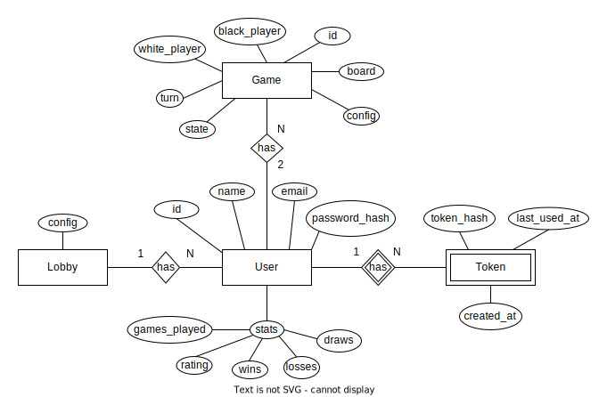
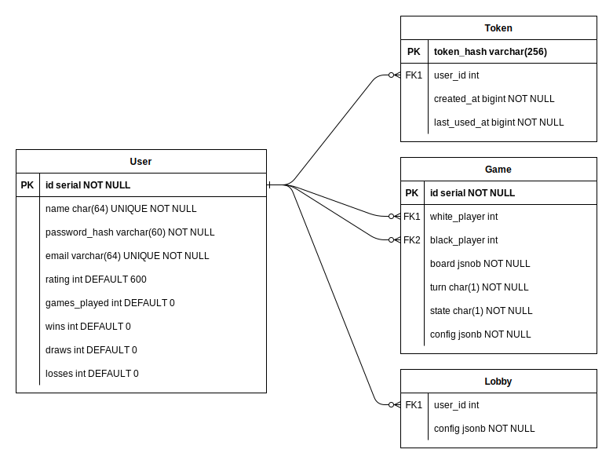

# Gomoku - Technical Document

This document contains the backend internal software organization, the data model and the main implementation challenges.

## Introduction

The backend server exposes a HTTP API that provides a system for the Gomoku game, written in [Kotlin](https://kotlinlang.org/) that uses the [Spring Boot](https://spring.io/projects/spring-boot) library for processing the HTTP requests. 

The backend implementation was made to be used by frontend applications that communicate with each other via the the backend service, which is responsible for ensuring all game rules, as well as managing and storing all game related data. It is also designed in a way to allow the evolution of game rules, including allowing different games to use different rules. The frontend applications adapt automatically to these evolving and dynamic game rules.


## Data Model

### Conceptual Model

The conceptual data model of the backend server is represented in the following diagram, that holds the 
entity-relationship diagram of the database:



It is also represented in the following relational schema:



The data model contains the following entities:
* The `User` entity represents a user of the system;
* The `Game` entity represents a game of Gomoku;
* The `Lobby` entity represents a lobby, which contains the users that are waiting to join a game;
* The `Token` entity represents a token used to authenticate a user;


The model also contains the following restrictions:
* __email__ must follow the following pattern "example@mail.com"
* __rating__, __games_played__, __wins__, __losses__, __draws__ must be greater or equal to 0
* The sum of __wins__, __draws__ and __losses__ must be equal to __games_played__
* In game properties, __turn__ and __state__ are represented with a single letter that corresponds to its enum class respectively.

### Physical Model

The physical data model contains the implementation of the conceptual data model in the PostgreSQL database, that can be found in the [create-schema.sql](./src/sql/create-schema.sql) file.


The physical data model contains the following aspects:
* All primary keys that are represented by the `id` attribute are `serial`;
* Other attributes that are not primary keys, but also identify the entity are marked as `unique`;
* All the restrictions described in the [Conceptual Model](#conceptual-model) are reflected in the physical model, using `check`;
* The `turn` and `state` attributes of the `Game` entity are implemented as a single unique character, which represents a corresponding enum value;
* The `board` and `config` attributes are stored as a JSON string, which is then parsed to the corresponding class using the [Jackson](https://github.com/FasterXML/jackson) library;
* The `created_at` and `last_used_at` attributes of the `Token` entity are stored as a bigint, which represents an instant in time.


## Application Architecture

### Software Organization

The backend server is organized in the following packages:
* [/http](./src/main/kotlin/pt/isel/daw/gomoku/http), which contains the controllers used to process the HTTP requests - [see more](#http);
* [/services](./src/main/kotlin/pt/isel/daw/gomoku/services/), which contains the classes that perform validations of parameters and implement the logic of the operations - [see more](#services);
* [/repository](./src/main/kotlin/pt/isel/daw/gomoku/repository/), which contains the interfaces and implementations that are used to access the PostgreSQL database, using a the [JDBI](https://jdbi.org/) library - [see more](#repository);
* [/domain](./src/main/kotlin/pt/isel/daw/gomoku/domain/), which contains all the core entities of the game - [see more](#domain);


#### HTTP

The HTTP package contains the controllers that process the HTTP requests.

The controllers are organized in the following classes:
* [controllers](./src/main/kotlin/pt/isel/daw/gomoku/http/controllers/), which contains the controllers that process the requests using the [Spring Web MVC](https://docs.spring.io/spring-framework/reference/web/webmvc.html);
* [pipeline](./src/main/kotlin/pt/isel/daw/gomoku/http/pipeline/), which contains the pipeline classes that process the requests, like the authentication and the error handling;
* [utils](./src/main/kotlin/pt/isel/daw/gomoku/http/utils/), which contains the utility objects that are used by the controllers, like the `Uris` and `Params`.


#### Services

The services package contains the classes that perform validations of parameters and implement the logic of the operations. It is responsible for receiving the parameters from the controllers, validating them and calling the corresponding repository methods to access the database.

The services are organized in the following classes:
* [UsersService](./src/main/kotlin/pt/isel/daw/gomoku/services/UserService.kt), which contains the services related to the `User` entity;
* [GameService](./src/main/kotlin/pt/isel/daw/gomoku/services/GameService.kt), which contains the services related to the `Game` entity;
* [LobbyService](./src/main/kotlin/pt/isel/daw/gomoku/services/LobbyService.kt), which contains the services related to the `Lobby` entity;

#### Repository

The repository package contains the interfaces and implementations that are used to access the PostgreSQL database, using a the [JDBI](https://jdbi.org/) library.

The repository is organized in the following classes:
* [UsersRepository](./src/main/kotlin/pt/isel/daw/gomoku/repository/UserRepository.kt), which contains the repository related to the `User` entity;
* [GameRepository](./src/main/kotlin/pt/isel/daw/gomoku/repository/GameRepository.kt), which contains the repository related to the `Game` entity;
* [LobbyRepository](./src/main/kotlin/pt/isel/daw/gomoku/repository/LobbyRepository.kt), which contains the repository related to the `Lobby` entity;
* [TokenRepository](./src/main/kotlin/pt/isel/daw/gomoku/repository/TokenRepository.kt), which contains the repository related to the `Token` entity;

This package also contains the `JdbiTransactionManager` used to access the database, and the `JdbiConfig` used to register the mappers of the application.


#### Domain

The domain package contains all the core entities of the game, such as:
* [User](./src/main/kotlin/pt/isel/daw/gomoku/domain/user/User.kt), which represents a user of the system;
* [Game](./src/main/kotlin/pt/isel/daw/gomoku/domain/game/Game.kt), which represents a game of Gomoku;
* [Lobby](./src/main/kotlin/pt/isel/daw/gomoku/domain/lobby/Lobby.kt), which represents a lobby, that contains the users that are waiting to join a game;
* [Board](./src/main/kotlin/pt/isel/daw/gomoku/domain/game/Board.kt), which represents the board of a game;

This package also contains the specific custom exceptions that are thrown by the application.


### Authentication

The authentication of the backend service is made using an Interceptor that is registered in the `PipelineConfigurer`, which is responsible for processing the `Authorization` or the `Cookie` headers of the requests, validating the token and retrieving a user.

The [`AuthenticationInterceptor`](./src/main/kotlin/pt/isel/daw/gomoku/http/pipeline/authentication/AuthenticationInterceptor.kt) class overrides the `preHandle` method, which is called before earch request is processed by the controller.
The controllers that require authentication have a custom parameter [Session](./src/main/kotlin/pt/isel/daw/gomoku/http/pipeline/authentication/Session.kt) that is injected by the interceptor, which contains the user that is authenticated and the user token. 


## Error Handling

The backend service uses an [Exception Handler](./src/main/kotlin/pt/isel/daw/gomoku/http/pipeline/ExceptionHandler.kt), which is responsible to catch all the exceptions thrown by the application and return the corresponding error response, with the corresponding status code and message, represented by the [Problem](./src/main/kotlin/pt/isel/daw/gomoku/http/media/Problem.kt) class, which is then represented in the JSON format. For example, when a player tries to play when it's not his turn, a NotYourTurnException is thrown, which is then converted to the following response:

```json
{
    "type": "https://github.com/isel-leic-daw/2023-daw-leic51d-08/tree/main/docs/problems/not-player-turn",
    "title": "Not Player Turn",
    "detail": "It's not your turn to play",
    "instance": "/api/games/1"
}
```


## Implementation Challenges

The implementation of the controllers with the `SirenEntity` class was a bit challenging, since we had to understand how `hypermedia` worked, and how it is used to represent entities in the JSON format.

While implementing the JDBI repository methods, we ended up having problems with the JDBI mappers, specially with the nested properties of the classes that were needed to map, such as the Game and Player mappers. 
Instead of the implementing multiple column mappers to allow the mapping of those two classes, we implemented row mapper for each one of them, which seemed easier to understand.

## Deployment

To run the application, make sure you have Docker Desktop installed, and execute the following command:

```bash
docker-compose up
```

# Conclusion

In conclusion, this technical document provides an in-depth overview of the Gomoku backend service. It outlines the application architecture, data model, software organization and various implementation details of the server.
The system is built with flexibility in mind, allowing for the adaptation of game rules in the future, and dynamic interaction between frontend applications and the backend service.

To enhance the system in the future, there are several potential improvements we can make, such as:
* Round timer for controlling the time each player has to make a move
* Implement more game variants and openings
* Implement a mechanism to delete expired tokens from the database
