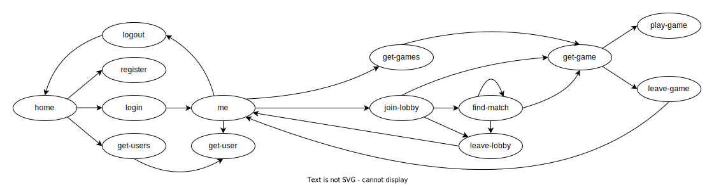

# Gomoku - API Documentation

This document contains the HTTP API documentation for a frontend client application.

## Introduction

This API is designed to be consumed by a frontend client application, divided by the following entities:
* [Home](#home), the entry point of the API;
* [User](#user), that provide actions such as register, login and get one or more users;
* [Lobby](#lobby), that provide actions such as joining, leaving the lobby and finding a match by a matchmaking algorithm;
* [Game](#game), that provide actions such as making a move, leaving a game and observing a game state.

## Media Types

This API uses the following media types:
* `application/json`, which is used in request bodies - [JSON](https://www.json.org/json-en.html)
* `application/vnd.siren+json`, which is being used in the response bodies - [Siren](https://github.com/kevinswiber/siren)
* `application/problem+json`, which is used in response errors - [RFC9457](https://www.rfc-editor.org/rfc/rfc9457.html)

This API uses [hypermedia](https://en.wikipedia.org/wiki/Hypermedia), which is a way of providing information to the client application about the available actions that can be taken from a certain resource.
* All the response bodies contain are represented by a [Siren](https://github.com/kevinswiber/siren), which contains the following properties:
    * `class`, which is an array of strings that represent the type of the resource;
    * `properties`, which is an object that contains the properties of the resource;
    * `entities`, which is an array of sub-entities that represent the sub-resources of the resource;
    * `actions`, which is an array of actions that can be taken from the resource;
    * `links`, which is an array of links that can be used to navigate to other resources.

* The available navigation links are:
    * `self`: Represents the uri of the resource itself
    * `home`: API Home
    * `user-home`: User Home
    * `get-user`: URI template to get a user
    * `get-game`: URI template to get a game
    * `next`: Next page of a paginated resource
    * `prev`: Previous page of a paginated resource

* The available actions are:
    * `register`: Register a new user
    * `login`: Login a user
    * `logout`: Logout a user
    * `get-user`: Get a user
    * `get-users`: Get users
    * `join-lobby` : Join the lobby
    * `find-match`: Find a match in the lobby
    * `leave-lobby`: Leave the lobby
    * `get-games`: Get games
    * `get-game`: Get a specific game
    * `play-game`: Play a game
    * `leave-game`: Leave a game
    * `get-black-player`: Get the black player of a game
    * `get-white-player`: Get the white player of a game
    * `get-opponent`: Get the player's opponent of a game

## API Navigation

The API navigation graphis represented in the following diagram:

We highlight the following aspects of the API journey:

* The `home` should be the first request the frontend application should make to the API. This request returns all the links for the actions that can be taken from there.
* If the frontend application is using Cookies for the user authentication, to check if a user is authenticated, the frontend application should make a request to the `user-home` resource,
and if it returns a `401 Unauthorized` status code, the user is not authenticated.
* The navigation uris are sent in the `links` and `actions` properties.
* There are operations and resources that are only available to authenticated users.

## Available Operations

### Home

In the home route you can find system details such as the API version and the authors, as well as discovering the main actions that can be taken from there, using hypermedia, as discussed in [API Navigation](#api-navigation).

### User

* __User Home__ - The user home contains all the actions that require authentication that can be taken from there. __Requires authentication__.

* __Register__ - Register a new user in the system.

    * The request body to this request should be a JSON object with the following properties:
        * `name` - the user's name __(required)__;
        * `email` - the user's email __(required)__;
        * `password` - the user's password (must have uppercase and lowercase letters, at least a number and a special character) __(required)__.
        
    * The client application should then login the user to get a valid token that should be used in authenticated requests.

* __Login__ - Login a user in the system.

    * The request body to this request should be a JSON object with the following properties:
        * `name` or `email` - the user's name or email __(required)__;
        * `password` - the user's password __(required)__.
        
    * This request returns a token that should be used in authenticated requests.
    * The token is refreshed every time an authenticated request is made.

* __Logout__ - Logout a user from the system. __Requires authentication__.

* __Get User__ - Get a user in the system.

    * The path parameter for this request is `userId`:
        * Type: `int`

* __Get Users__ - Get users from the system, which can be used for a leaderboard __(supports pagination)__.

    * The query parameters for this request are:

        * `page` - the page number of the paginated resource  __(optional)__.
            * Type: `int`
            * Default: `1`
             
        * `limit` - the max number of users to include __(optional)__.
            * Type: `int`
            * Default: `10`
            * Max: `100`

        * `orderBy` - the parameter to order by the users __(optional)__.
            * Type: `string`
            * Default: `rating`
            * Must be one of the following `[name, rating, games, wins]`
            
        * `sort` - the direction to sort the users __(optional)__.
            * Type: `string`
            * Default: `asc`
            * Must be one of the following `[asc, desc]`

### Lobby

* __Join Lobby__ - Joins a user to the lobby.
    
    * The request body to this request should be a JSON object with the following properties:
        * `boardSize` - the board size for the game __(required)__.
            * Type: `int`
            * Must be one of the following `[15, 19]`
            
        * `variant` - the variant the user wants to play __(optional)__.
            * Type: `string`
            * Must be one of the following `[freestyle]`
            * Default: `freestyle`
            * There are variants that are not implemented yet.
            
        * `opening` - the openning rule the game should follow __(optional)__.
            * Type: `string`
            * Default: `freestyle`
            * Must be one of the following `[freestyle, pro, long_pro]`
            * There are openings that are not implemented yet.

    * After joining the lobby, the client should poll the `find-match` request to check if a match was found.

* __Find Match__ - Finds a match for a user in the lobby. __Requires authentication__.

    * It is required that the user is already in the lobby to find a match
    * If match is found, a `200 Ok` status code is returned, and the client should then get the game using the return `get-game` action link.
    * If match is not found, a `202 Accepted` status code is returned, and the client should poll this request again. The polling interval is determined by the server, defined
    in the `Retry-After` header.

* __Leave Lobby__ - Leaves a user from the lobby. __Requires authentication__.

    * It is required that the user is already in the lobby to leave the lobby

### Game

* __Get Game__ - Get the specific state of a game by id. 

    * The path parameter for this request is `gameId` - the id of the game to get. __(required)__;
        * Type: `int`

 
* __Play Game__ - Makes a move in a game. __Requires authentication__.

    * The request body to this request should be a JSON object with the following properties:
        * `row` - the row of the move to play __(required)__.
            * Type: `int`
            * Must be in the range `[1, boardSize]`
            
        * `col` - the column of the move to play __(required)__.
            * Type: `int`
            * Must be in the range `[1, boardSize]`

* __Get Games__ - Get games in the system __(supports pagination)__.

    * The query parameters for this request are:
        * `username` - filter games that only include a specific user, which can be used for a user profile __(optional)__;
            * Type: `string`
        
        * `state` - filter games by state, which can be used for a spectating system for games that are currently happening __(optional)__.
            * Type: `string`
           
        * `page` - the page number of the paginated resource  __(optional)__.
            * Type: `int`
            * Default: `1`
             
        * `limit` - the max number of games to include __(optional)__.
            * Type: `int`
            * Default: `10`
            * Max: `100`
            
        * `sort` - the direction to sort the games __(optional)__.
            * Type: `string`
            * Default: `desc`
            * Must be one of the following `[asc, desc]`.

    * The games are always sorted by id (since they are serial, they are also sorted by date).

* __Leave Game__ - Leaves a user from a game. __Requires authentication__.

    * It is required that the user is already in the game to leave the game

## Authentication

The authentication is made using a token, which is required to be in one of the following headers in a request:
* `Authorization Header`
  * Uses the [Bearer](https://swagger.io/docs/specification/authentication/bearer-authentication/) authentication scheme.
* `Cookie Header` 
  * Uses the [Cookie](https://swagger.io/docs/specification/authentication/cookie-authentication/) authentication scheme.

Each user has a max of 3 tokens, and if a user tries to login with more than 3 tokens, the oldest token is deleted.
The token has max validity of 15 days, but if no authenticated request is made in 3 days, it expires.
When it does, the user should login again to get a new token.

